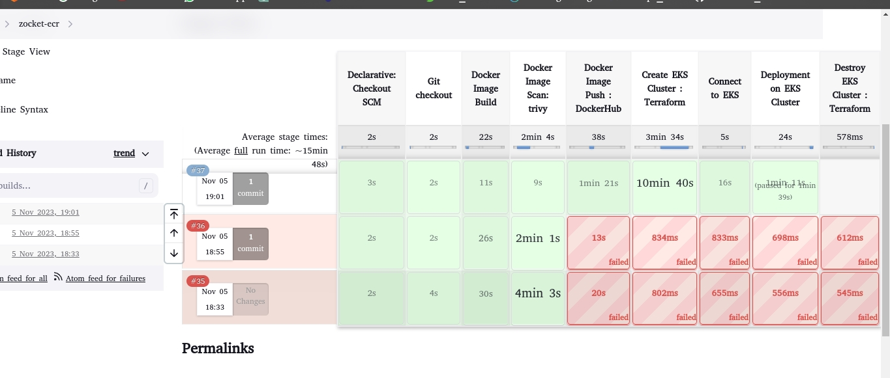
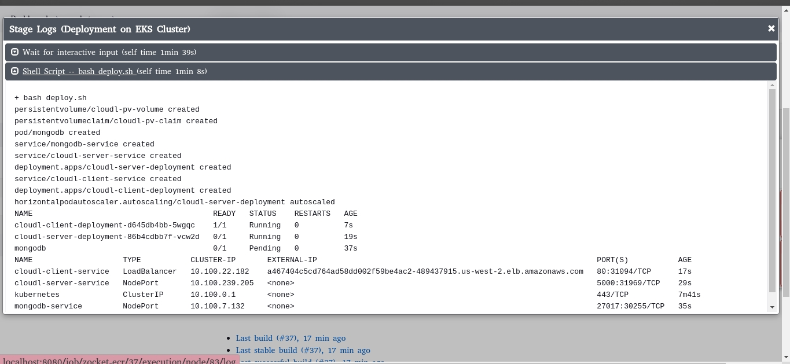
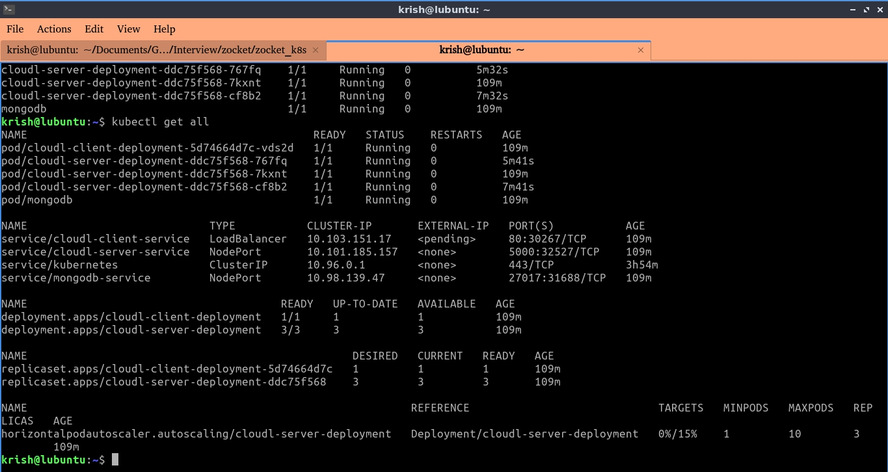
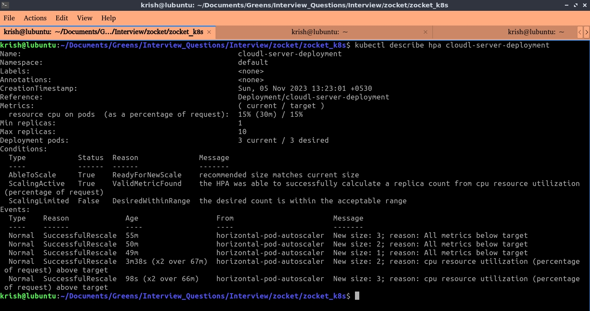
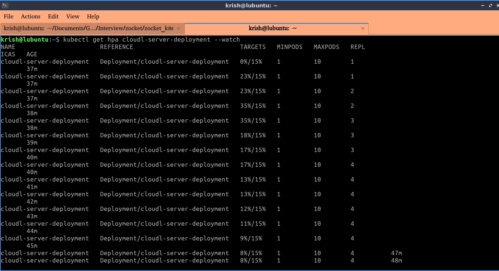
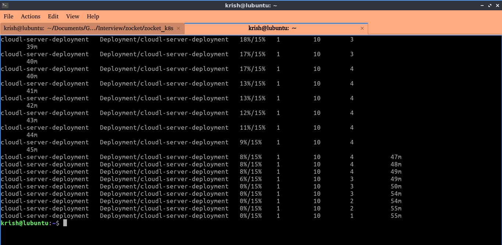
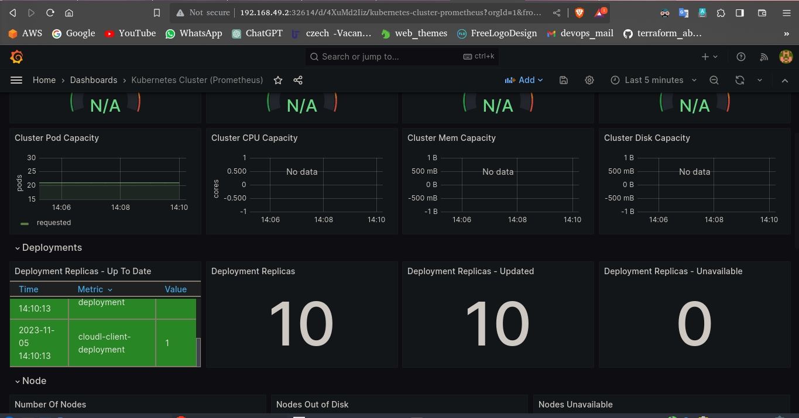
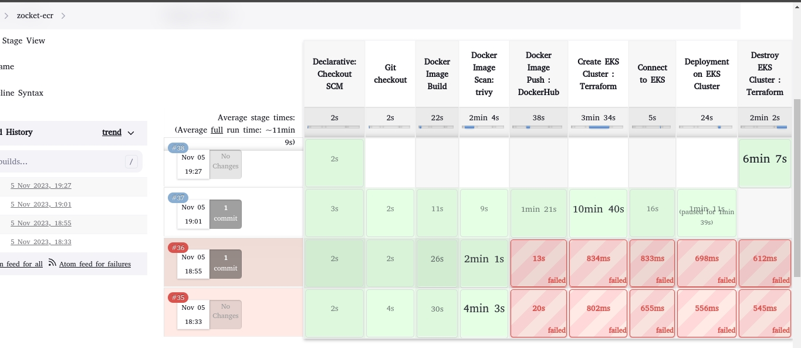

# Standford cars classfication web app deployment using Pytorch and Flask 💵💳

  

## 🎯 Purpose of the Project
To design and implement a Kubernetes deployment and scaling solution for a web application. The goal of this assignment is to showcase the knowledge and skills in deploying and managing applications using Kubernetes.

## 🏁 Technology Stack

* Git
* Jenkins
* Docker
* Kubernetes
* Terraform
* Prometheus
* Grafana
* AWS

## 🎯 Procedure:

1. Find out the front end and back end from the internet and wrote a docker file.
2. containerize the application and push the image into the DockerHub.
3. Write the Kubernetes deployment and service manifests to deploy the application into the kubernetes cluster.
4. Ensure the application running well and increase the load artificially to check the  HPA behavior of the pods
5. Git used as a SCM and Jenkins used for automate the CI and CD process.
6. Terraform used for provision the AWS EKS cluster then Jenkins can able to deploy the application into that.

## 🎯 Sample Images in a Single batch

Steps:
1. Both Front and Back End applications are stored in the GitHub for version control and achieve Continuous Integration.
2. Jenkins used for write a Continuous Integration pipelines and store credentials, store secrets where Jenkins plug-ins are used for get additional functionality.
3. GitHub integrated with Jenkins using GitHub plug-in then created docker images using Docker pipelines plug-in.
4. Then the Docker images are scanned by trivy which is installed using trivy.sh and reports are stored in a txt file.
5. To push the images to the Docker Hub which is a Artifact Repository, its credentials stored as a secrets in Jenkins, a Jenkins stage after image  scanning created and imaged pushed to the DockerHub.
6. The kubernetes manifests are written which includes front and back end, deployment and service file, mongo db pod and service files, persistent volume and persistent volume claim manifests.
7. Terraform modules which includes kubernetes configuration,  providers, node configurations, variables are stored in eks_module. These modules are used for provisioning kubernetes cluster in “create EKS cluster” stage.
8. In Jenkins AWS credentials are stored and regions and cluster name’s are passing as a parameters which is used for create and authenticate the AWS EKS cluster during “connect to EKS” stage.
9. When connected to the EKS, change the wokring dir to K8S , then run deploy.sh which then install the all the manifests into the kubernetes cluster including the HPA.
10. LoadBalancer in AWS gives the URL to expose the application to the internet. By, hitting up the URL we can access the application.
11. After Ensuring the successful deployment of application, check out the HPA behavior by increasing the load manually.
12. For monitoring the cluster, helm chart was used for install full stack prometheus and grafana monitoring tools.
13. Then the monitoring services are exposed through the LoadBalancer and configured the dashboard through the grafana.

## 🎯 Appendix
1. End to End CICD pipelines

 

  

2. Deployed on EKS

 

  

3. Get the all the services running in the cluster

 

  

4.Description the HPA

 

  

5. Verify the HPA behavior

 

  

 

  

6. Monitoring using the Grafana dashboard

  

7. Destroy the Cluster

  

## 📜 LICENSE

[MIT](https://github.com/git/git-scm.com/blob/main/MIT-LICENSE.txt)
    
